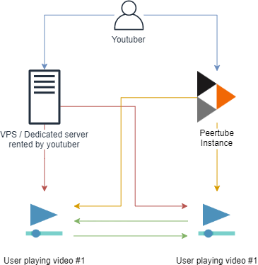

---

Template: post

title: Es posible una alternativa a Youtube? Sí, pero hay problemas que resolver aún.

description: Es posible crear una alternativa a Youtube, y ya hay algunas propuestas, pero los problemas son muchos y las soluciones no están claras.

date: 2019-11-12 14:46

author: iagovar

---

<!-- 

 -->

Supongo que estás aquí porque tienes curiosidad, o tienes un canal en Youtube, y estás explorando la posibilidad de tener una alternativa, o aunque sea un backup, de Youtube.

Has escuchado que Youtube no ha tenido nunca beneficios, asi que, teniendo en cuenta que hay pocas máquinas de generar dinero como Google Adwords, no parece un negocio atractivo para la competencia.

Has escuchado que existen alternativas libres y federadas, pero lo que has encontrado es confuso, y algunas de estas páginas llenas de fanáticos de la conspiración, nazis, y en general gente con la que no te gustaría que te asociaran.

En este post voy a tratar de responder a esta inquietud, delimitando dónde estamos, qué posibilidades existen y qué retos quedan por resolver.

## Dónde estamos

Desde un punto de vista superficial, Youtube es fácil. Es fácil abrir un canal, y subir contenido. No tienes que preocuparte de las complejidades técnicas de hospedar un vídeo. Para el consumidor de vídeos, es un sitio donde está todo el contenido que quieres ver.

[Esto no fué así siempre](https://www.youtube.com/watch?v=OU6CuSMzNus), hace no demasiado tiempo (si tienes incluso poco menos de treinta años lo recordarás) Internet era un lugar diverso, donde no existía mucha estandarización y hospedar contenido online requería de algunos conocimientos. En aquellos años, grabar y editar vídeo no era un conocimiento al alcance de cualquiera, y las capacidades del software no profesional de aquel entonces eran muy primitivas.

La razón por la que Internet se ha convertido en lo que es hoy, una especie de conjunto de silos corporativos, es porque es la forma más eficiente, desde un punto de vista económico y organizativo, de extraer rentas de aquellos que pagan, esto es, los consumidores (piensa en comercio electrónico) y los anunciantes (piensa en cualquier sitio que lleve anuncios), con la ventaja añadida de que, además, también es más cómodo para los consumidores y para los anunciantes.

Esto tiene una contrapartida, que seguramente ya conoces. Una empresa tiene que moderar una avalancha de contenido, y además puedes ser censurado. En el antiguo internet la moderación del contenido estaba distribuída, de manera que era más manejable. Cada pequeño sitio podía, con mayor o menor dificultad, digerir el contenido que los usuarios subían a sus sitios, ayudados por el hecho de que la población tenia una alfabetización digital menor (de manera que el volúmen total era también menor) y la fricción para publicar texto, imágenes o vídeo en Internet era mayor.

La censura también era diferente. En aquellos años si el dueño de un sitio web te censuraba te ibas a otro. Seguramente nadie disfrutaba con ello, pero no era dramático. Hoy en día Youtube te retira tu canal y tienes un serio problema. Además, en aquel entonces, las autoridades estaban muy perdidas en esto de Internet en la mayor parte del mundo. Hoy en día saben que es suficiente expulsar a alguien de unos pocos sitios para que en la práctica esa persona pierda toda su audiencia, obligándolos así a refugiarse en dominios que son asociados con los extremos de la sociedad, y cumpliendo así el doble objetivo de proporcionar otro argumento contra ellos ¿Veis como son los nazis? ¡Tienen un canal en X!

## ¿Qué iniciativas existen ahora? ¿Qué ideas tienen?

Creo que podemos dividir los esfuerzos en dos grupos.

### 1. Los "Youtube sin ser Youtube"

Básicamente [Dailymotion](https://www.dailymotion.com/) sería el único candidato. Actualmente el sitio ha pivotado a un modelo más parecido a la TV donde no hay interacción. Antiguamente se podía comentar en los vídeos, pero supongo que no lo verían claro, asi que viendo que no podían competir con Youtube por los [efectos de red](https://en.wikipedia.org/wiki/Network_effect), se desharían de toda la grasa. Pero es una compañía francesa, lo que significa que, llegado el día, podrían dar un paso adelante. En Francia existe [cierta resistencia a rendirse a Sillicon Valley](http://iagovar.com/european-web-hosting-alternatives). Es decir, si llegase un ventana de oportunidad, y hiciese falta dinero para desarrollo, probablemente lo habría.

Luego hay cosas graciosas como [Vidlii](https://www.vidlii.com), que no deja de ser una especie de experimento amateur. Tiene limitaciones para los vídeos, como 2GB, 20 minutos, etc. Es el proyecto de un tipo alemán que seguramente le apetecía montar un sitio que se parece a Youtube en 2008, pero claro, tendrá que pagar el hosting de su bolsillo. El mismo tipo montó [Vlare](https://vlare.tv/), que parece más prometedor, pero no estoy seguro de qué tan serio puede ser, porque parece depender de un sólo tipo, y el proceso de registro y acceso está mal (llevo unos días comunicándome con ellos). A saber cuánta gente ha querido registrarse y no ha podido.

<blockquote class="twitter-tweet">
We make our money from other projects we&#39;ve worked on, which are quite profitable. Additionally, the creator of the project has at least 2 years worth of money for server costs as backup. Not to mention, the obvious ads and premium subscription which users can buy to support us.
&mdash; Vlare (@VlareTV) <a href="https://twitter.com/VlareTV/status/1194351412097929216?ref_src=twsrc%5Etfw">November 12, 2019</a></blockquote>

<iframe width="640" height="360" src="https://vlare.tv/embed/aPFEbXIh/false/true/49" frameborder="0" allowfullscreen></iframe>

El problema de estos sitios es que, naturalmente, acabarán teniendo los mismos problemas de Youtube. Eventualmente tendrán que hacer frente a la factura que supone permitir que se suban cifras astronómicas de gigas a tu sitio, tendrás que moderar ese contenido (con las irreales expectativas que tiene la población general y los políticos sobre las capacidades del <i>machine learning</i>), y además, nada impide que tu posición ideológica sea molesta para esta compañía y te encuentres fuera.

### 2. Los "Vamos a revolucionar el mundo con el P2P y Blockchain!!!"

En este apartado encontramos soluciones como [Peertube](https://joinpeertube.org/), [Bitchute](https://www.bitchute.com/), [D.Tube](https://d.tube/) y algunas otras. 

<a href="https://www.blender.org/media-exposure/youtube-blocks-blender-videos-worldwide/">La fundación Blender probando Peertube</a>

  

<iframe width="560" height="315" sandbox="allow-same-origin allow-scripts" src="https://video.blender.org/videos/embed/3d95fb3d-c866-42c8-9db1-fe82f48ccb95" frameborder="0" allowfullscreen></iframe>

No todo el mundo está convencido de estas soluciones.

<blockquote class="twitter-tweet">
Vlare is a centralized platform, and that&#39;s how it ought to be. Decentralized platforms are unstable, and more of a marketing stunt than an actual improvement (at least in my personal opinion).
&mdash; Vlare (@VlareTV) <a href="https://twitter.com/VlareTV/status/1194018192860962818?ref_src=twsrc%5Etfw">November 11, 2019</a></blockquote>

Es cierto que la mayoría de las plataformas P2P son inestables y, al menos lo parecen, más un experimento de márketing para sufear la ola de lo <i>descentralizado</i> que otra cosa.

Sin embargo, si partimos de la base de que uno de los principales motivos por los cuales Youtube no conseguía generar beneficios son los costes de alojamiento y ancho de banda, una tecnología como <a href="https://webtorrent.io/">Webtorrent</a>, utilizada en Peertube y Bitchute, e <a href="https://ipfs.io/">IPFS</a> como la que utiliza D.Tube, supone que al menos parte de esos costes se pueden externalizar.

Supongamos el caso de Webtorrent, que es en mi opinión el más prometedor. El usuario entra en nuestro WebTube hipotético, y hace click en uno de los vídeos. El vídeo se empieza a descargar de otros usuarios que lo estén viendo, del creador de contenido, que está usando una <a href="https://es.wikipedia.org/wiki/Seedbox">seedbox</a> para que sus vídeos siempre tengan un buen ancho de banda, y quizá, del propio servidor que tiene WebTube para garantizar, al menos, un ancho mínimo.

Si el vídeo se hace más popular, el esfuerzo se reparte entre WebTube, el seedbox del creador de contenido, y los usuarios. La mayoría de usuarios en países como España tienen ya velocidades simétricas, y generalmente superiores a 100mbps (no se enfaden los que viven en el rural). Las conexiones móviles son muy variables, pero en 4G en condiciones promedio de saturación puede que estemos hablando de unos 10mbps en subida. En cuanto a los seedboxes se pueden encontrar por precios razonables y anchos de banda de unos 20gbps. Hoy en día, si ganas dinero con tus vídeos, el precio de comprar un servidor administrado con buen ancho de banda es trivial. Si la mayoría de tus usuarios son españoles lo hospedas en España, y si son internacionales quizá en los países bajos. Tampoco hay nada que te impida tener varios seedboxes para varias audiencias. Con un enlace magnet, además, sólo tendrías que subir el archivo a uno de ellos y pasar el enlace al resto para que el archivo se replique sin esfuerzo.

Igual que en bittorrent, cuantos más seeds, mayor es el ancho disponible. Si tienes dos seedboxes de 20gbps, eso significa 40gbps de ancho disponible para quien visualize tus vídeos, mas el ancho que te proporcione el WebTube de turno, y los usuarios que se queden un rato viendo el vídeo.

El hecho de alojar el contenido permite que además cualquiera pueda reproducirlo con un enlace magnet. <a href="https://instant.io/#magnet%3A%3Fxs%3Dhttps%253A%252F%252Fvideo.blender.org%252Fstatic%252Ftorrents%252F3d95fb3d-c866-42c8-9db1-fe82f48ccb95-360.torrent%26xt%3Durn%3Abtih%3A4a5d29d447a4b69c99503d1ac452255b4ad1877c%26dn%3DSpring%2B-%2BBlender%2BOpen%2BMovie%26tr%3Dwss%253A%252F%252Fvideo.blender.org%253A443%252Ftracker%252Fsocket%26tr%3Dhttps%253A%252F%252Fvideo.blender.org%252Ftracker%252Fannounce%26ws%3Dhttps%253A%252F%252Fvideo.blender.org%252Fstatic%252Fwebseed%252F3d95fb3d-c866-42c8-9db1-fe82f48ccb95-360.mp4">Aquí tienes un ejemplo con el mismo vídeo de Blender que puse arriba</a>.

Si no te gusta WebTube, te vas a otro lado, y sólo tienes que proveer una lista de tus enlaces magnet.

## Los problemas no son pocos

En el caso de las alternativas que quieren replicar a Youtube, ya lo hemos comentado. <b>No creo que sea posible replicar Youtube sin tener los mismos problemas</b>. El hospedaje y el ancho de banda puede ser prohibitivo a niveles moderados de popularidad.

En el caso de las alternativas P2P, Webtorrent expone la IP del visitante a todo aquel que esté descargando o subiendo el vídeo. Básicamente igual que bittorrent. Para muchas personas esto es un problema de seguridad, pero ciertamente es inevitable. También existe un problema con la experiencia de visualización. En la mayoría de los casos, cuando un usuario visita Youtube, el vídeo se reproduce inmediatamente. Esto en P2P no suele ser tan rápido, y dependiendo de lo popular que sea el vídeo se puede hacer bastante lento. Un retraso de cinco o seis segundos puede parecer poco tiempo cuando lo estás leyendo, pero para los usuarios, acostumbrados a que todo en internet sea casi instantáneo, es una eternidad.

No será un problema para quien esté dispuesto a contratar un servidor y hospedar sus vídeos (no hay más que ver el vídeo de Peertube, funciona perfectamente), pero piensa que mucha gente no lo va a hacer, o como mucho, lo hará desde su domicilio con un equipo con conexión intermitente. Al contreario de lo que sucede con el hospedaje tradicional, cuanto más popular sea un vídeo más ancho de banda disponible habrá. Bucear en contenidos desconocidos se hará más lento y problemático.

Aún cuando las tecnologías P2P pueden resolver una gran parte del problema del coste de los vídeos, manejar un sitio con mucha fama no es un problema en absoluto trivial.

### El problema de la censura y los filtros no tiene solución

Las alternativas P2P tampoco se van a librar de los problemas de moderación y censura. También podrás ser expulsado de nuestro hipotético WebTube, y esta web también puede tener un sistema de moderación de vídeos y comentarios que no te guste.

Una respuesta típica de los evangelizadores del P2P es que la plataforma no tiene el control del contenido, sólo de los metadatos (el número de visitas, los comentarios y otras métricas de tu vídeo), y que en cualquier caso estos datos se pueden alojar en una cadena de bloques.

Cualquier cadena de bloques va a ser más lenta que una base de datos relacional típica, y de cualquier modo, el punto es irrelevante. Cuando estás suscrito a más de 50 youtubers no le sigues la pista a todos, confias en que Youtube sepa hacerte llegar su contenido cuando es necesario. Si uno de ellos, que no publica de forma muy frecuente, tiene problemas y decide irse, sólo te enterarás por pura suerte (haber visto un aviso suyo en otra red social) o porque otra persona te avisa. Hay demasiado ruido, y tu capacidad de atención es limitada. Eres humano.

Los usuarios lo que buscan es comodidad. Quieren teclear un nombre de dominio, y que tengan allí prácticamente todo lo que quieren. O como mucho un puñado de ellos, no cientos. Imagina que cada Youtuber sólo publicase los vídeos en su dominio. Sería una locura estar al tanto de todos, y habría que hacer un esfuerzo activo para acordarse de cada uno de ellos. No es viable. Yo tengo un montón de marcadores, bien organizados, con webs que me gustan, y no me acuerdo de visitar la mayoría de ellas ni siquiera una vez a la semana. Sólo con unas cinco o seis que visito diariamente. <a href="https://www.nngroup.com/articles/participation-inequality/">Y creo que yo soy un <i>power user</i> no un <i>lurker</i></a>.

En mi opinión no es posible resolver este problema. Es posible educar a tus seguidores para que, si quieren apoyarte, lo hagan por medios independientes (como es el caso de muchos Youtubers con Patreon), con un éxito moderado, pero no se van a acordar de 50 dominios. Olvídate de eso.

Piensa en Netflix. Ahí fuera existen la posibilidad de conseguir gratis un montón de contenido que de otra forma sería de pago. Sin embargo Netflix ocupa un espacio cada vez mayor. ¿Por qué? Porque es más cómodo que andar buscando trackers, ver enlaces que funcionan, otros que no, torrents que no tienen suficientes seeds, webs que tienen enlaces falsos... toda esa fricción es la que Netflix le ahorra al usuario. Tiene éxito porque el tipo se sienta en el sofá y su cerebro descansa. Así de sencillo.

### Los anunciantes no quieren problemas, pero sí experimentan

Los anunciantes quieren controlar dónde se publican los anuncios, porque no quieren malgastar dinero. Una marca de cosméticos podría estar derrochando dinero si sus anuncios salen en <i>gameplays</i>. De hecho, el principal reclamo de Adwords y Facebook Ads (que son aproximadamente el 50% de la cuota de mercado en este sector) es el control. Saber qué haces con tus anuncios.

Esto es posible porque estas empresas gastan mucho dinero en trazar a sus visitantes y evaluar el contenido que se sube en su plataforma. En el momento en que WebTube se haga un poco popular no será posible evaluar de forma manual el contenido que se sube. Llegado ese momento puedes hacer dos cosas, o montar un caro sistema de <i>machine learning</i> que evalúe todo ese contenido, o básicamente aceptar que la vida es así, y que los anunciantes se peleen con el caos.

El caos alejará a los anunciantes más conservadores (típicamente empresas grandes que tienen mucho dinero), lo que supondrá menos dinero a repartir entre todos. ¡Y también debes moderar a los anunciantes! No querrás que tu anuncio de cosméticos acabe al lado de un anuncio pornográfico, sobre todo te da un vuelco al corazón cada vez que alguien te critica en Twitter (Y habiendo trabajado en el sector puedo confirmar que hay directivos con un sentido ridículo de lo que es un desastre de relaciones públicas).

Esto, desde luego, es un problema, sin embargo he de desmentir el discurso fatalista de que los anunciantes no se van a arriesgar. Si algo de todo esto final pasa, se arriesgarán, porque ya lo hacen. En PornHub se han anunciado [Eat24](http://archive.is/gyJ35) (lectura recomendada), [Diesel](https://fightthenewdrug.org/these-major-companies-are-now-using-porn-sites-to-advertise-their-product/), [un político danés](https://nh1.com/nh1/this-danish-politician-placed-an-election-ad-on-pornhub-and-his-explanation-is-refreshing-to-hear/), [Marvin.ie](https://www.reddit.com/r/ireland/comments/9k0euj/noticed_pornhub_adverts_werent_trying_to_sell_me/) hasta [Unilever y Kraft](https://www.cnbc.com/2019/11/04/unilever-and-kraft-heinz-criticized-by-politician-over-pornhub-adverts.html) [[2]](https://www.bbc.com/news/business-50283716), y esto es simplemente de lo que yo me acuerdo.

¿Has leído los dos últimos enlaces? ¿Te has fijado en el pánico moral? Unos tipos del departamento de márketing, que saben que la mayor parte de la población que sabe usar un PC consume porno de forma habitual han llegado a una conclusión lógica. Mucha gente usa Pornhub, es más barato que Youtube y además hay gente a la que le hace gracia ver esos anuncios en un sitio pornográfico. Todo funciona con normalidad hasta que a alguien le da un vuelco al corazón porque un tipo de la prensa lo ha acusado de cualquier cosa.

En la forma de escribir el párrafo anterior creo que ya está implícita la visión que tengo del tema, pero independientemente de nuestra perspectiva moral, el mundo real funciona así. Y nuestro WebTube tendrá problemas en este sentido, a menos que quiera construír una máquina de analizarlo y clasificarlo todo. Eso significa dinero y mucho esfuerzo.

Ahora, a pesar de todo esto, imagina que quieres hacer un canal con un contenido dirigido a adolescentes o niños pequeños. Si nadie controla esta cuestión, puede ser un problema.

### El problema del Copyright

Si has visitado alguna vez algún sitio con contenido pirata, también habrás visto anuncios. Es decir, hay gente pagando por que ese anuncio esté ahí. Sin embargo si quieres acceso a los grandes presupuestos de publicidad, proteger la propiedad intelectual también es fundamental. Especialmente si el anunciante es del sector audiovisual. Y ya no hablemos de los problemas legales a los que te expones.

En Youtube podemos ver cómo el sistema de protección de copyright es constantemente abusado por compañías y por gente que quiere hacer desaparecer un vídeo o un canal por otros motivos (sean políticos o por competencia). Supongo que si preguntásemos, la mayoría de los Youtubers diría que Youtube no hace un esfuerzo suficiente por vigilar que estos problemas no se reproduzcan, y que el soporte que brinda la plataforma es prácticamente nulo ([una constante en todos los servicios de Google, la verdad](http://iagovar.com/european-web-hosting-alternatives)), sin embargo estamos hablando de crear una alternativa con una fracción del presupuesto que tiene Google. No creo que vayamos a conseguir algo mejor.

### El problema del descubrimiento

[Existe un buen debate sobre el problema del descubrimiento](https://news.ycombinator.com/item?id=21513595), que en esencia pivota sobra la idea de que uno de los principales atractivos de Youtube es que es fácil descubrir contenido relacionado o nuevo en Youtube, porque todo está indexado en el mismo sitio y porque la compañia se esfuerza en perfeccionar el sistema de recomendaciones, a pesar de que lucha contra mucha gente que quiere alterarlo, sea por motivos comerciales o políticos.

En mi opinión una alternativa a Youtube puede copiar el modelo centralizado de indexación con la externalización del coste de hospedaje a través de P2P, que tendrá problemas en el inicio, porque el trasvase de contenido lleva tienpo, pero que podrá ser emulable. El modelo federativo que proponer Peertube lo tendrá más complicado, porque aunque la plataforma permite indexar contenidos de otras instancias de peertube, es el administrador de la misma el encargado de este registro. Si realmente el mundo cambiase y casi todo el contenido estuviese ocupado muchos pequeños silos, el trabajo de dichos administradores sería extenuante.

### La teconología también tiene que ser fácil de administrar

Peertube, Bitchute y D.Tube parecen más o menos adecuadas desde el punto de vista del usuario. Aún les falta ser pulidas (por ejemplo, los códigos de incrustación no son <a href="https://es.wikipedia.org/wiki/Dise%C3%B1o_web_adaptable">adaptables</a>). Las interfaces no son malas, pero bueno, realmente tampoco están muy por detrás.

Peertube, que es el único software de este tipo que puedes instalarte tú mismo, <a href="https://es.wikipedia.org/wiki/Dise%C3%B1o_web_adaptable">requiere de más conocimientos que los necesarios para instalar, por ejemplo, Wordpress</a> en un hosting compartido. Esto significa que mucha gente, especialmente la mayoría de Youtubers que son, probablemente, hombres orquesta, no se van a molestar en instalar una instancia.

Contratar un VPS y configurar un acceso por SSH o VNC es una cosa, que para mucha gente ya puede ser complicada. Administrar un software como este, y enfrentar los problemas que pueden surgir durante la instalación y el mantenimiento, es otro nivel.

Sé perfectamente que esta gente no cobra por el software, y siendo estrictos nadie tiene derecho a reclamarles nada. La mayor parte del software de código abierto es un trabajo muy desagradecido, lo sé. Pero aún así, creo que muchos desarrolladores no tienen las ideas claras cuando tienen una misión en mente, o no son capaces de reconocer que hacen un proyecto porque les gusta una tecnología determinada.

Pero si creas software con una misión, antes de ponerte a escribir código piensa en quién es tu audiencia, de lo contrario será un esfuerzo, en gran medida, malgastado.

Mi hermano tenía un pequeño negocio. Le enseñé algunas cosas sobre Excel, y cómo buscar soluciones en Internet. Ahora es un fanático de Excel porque le permite resolver muchos problemas de forma fácil que no se pueden resolver con CRMs, programas de contabilidad, de almacén, ni otras aplicaciones para pequeñas empresas. También le podría enseñar SQL y muchas otras cosas, pero sé que no va a pasar. SQL es genial, pero mi hermano no es el tipo de persona que va a aprenderlo. Comprende las limitaciones de Excel, pero no tiene el tiempo ni la energía para plantearse algo más avanzado. Igual que yo uso PicoCMS y le he recomendado usar Wordpress, y tampoco ha sabido instalarlo, porque antes de eso tendría que entender cómo funcionan los dominios, que es una DNS, cómo se usa un FTP, etc. Mi hermano tiene casi 50 años, asi que lo que ha hecho es contratar a alguien que lo haga por él. Su objetivo en la vida es dedicarse a lo que le gusta, y ganar el dinero suficiente para vivir y disfrutar con lo que hace, no aprender SQL ni cómo funcionan las DNS. Y eso está bien.

De la misma forma, la mayoría de los Youtubers no ganan mucho dinero, seguramente la mayoría de ellos ya han hecho un esfuerzo considerable para aprender a editar vídeos. La mayor parte del tiempo y de la energía mental de la que disponen lo usan para pensar en nuevos vídeos que pueden hacer, y en si será posible vivir de los vídeos o no. No es razonable esperar que muchos de ellos aprendan a administrar una VM con Debian, su servidor web, su base de datos, systemd, openrc, etc. Ni hablemos de debugging y casos atípicos, son un muro insalvable, no como un tutorial.

Creo que el nivel óptimo entre libertad y facilidad es precisamente el que ha alcanzado Wordpress. Un usuario relativamente motivado puede instalarlo y administrarlo en poco tiempo. El hospedaje es muy barato, y es fácil de usar. Creo que si PeerTube, o cualquier otra alternativa, tiene la misión de proporcionar un software que sea ubícuo, y que la gente que realmente está buscando respuesta a la pregunta de este post, pueda usarlo, tiene que acercarse a este modelo. ¿Quizá empaquetarlo? Desde luego un <code>sudo apt-get install peertube</code> ya sería un paso importante. Sobre todo si incluye frontends para manejar los servicios necesarios, a pesar del problema que supone que alguien tenga que aprender a manejar una VM.

## Conclusiones

1. Los problemas tecnológicos y de costes asociados al hospedaje y al ancho de banda son resolubles. La tecnología no está madura del todo pero tampoco está muy lejos, en particular Webtorrent.

2. Mayor libertad e independencia significa, en la mayoría de sus facetas, mayor caos. Quienes quieran que creen o usen las nuevas alternativas a Youtube tendrán que escoger algún grado entre estos dos opuestos. En cuanto el volúmen de contenido sobrepase las capacidades humanas de supervisión, habrá de automatizarse, y esto implica que habrá gente que pague un precio, bien por encontrarse en un caso atípico o bien porque los ingenieros que han desplegado el sistema no pueden describir de forma discreta cómo funciona, y por tanto siempre habrá situaciones indeseables que no se podrán resolver satisfactoriamente.

3. Los problemas asociados a la publicidad y el copyright están también relacionados con el caos. Hay anunciantes para el caos, pero no son los grandes billetes. Quien cree una alternativa también deberá pensar en esto, porque es un problema complejo, aunque no imposible de resolver. Actualmente, la mayoría de SSPs/DSPs (para quien no esté al tanto de terminología <i>adtech</i>, piensa en Adsense/Adwords) que trabajan con el caos están repletos de anuncios de pornografía, alargamiento de pene y cosméticos mágicos. He trabajado con algunos en el pasado y sí categorizan los anuncios, pero el control es un poco vago, supongo que porque los márgenes son pequeños.

	Quizá sería interesante que alguien analizase bien este sector de manera conjunta con el problema que plantea este post. Es otro ángulo a atacar.

4. Creo que no estamos tan lejos como mucha gente cree de una alternativa viable, al menos desde un sistema de indexado centralizado con hospedaje descentralizado. Los efectos de red serán muy complicados de superar, y Youtube luchará por esto (aunque previsiblemente molestando a todo el mundo menos a los grandes anunciantes, quizá sirva como munición contra ellos). Webtorrent necesita más amor, alguien tiene también que hacer el trabajo de implementar el protocolo en otras librerías como libtorrent para que la mayoría del software que actualmente trabaja sobre bitorrent pueda subirse al tren.

Creo que no me dejo nada en el tintero. Si tienes algo que decir, tienes la sección de comentarios y @iagovar en Twitter.